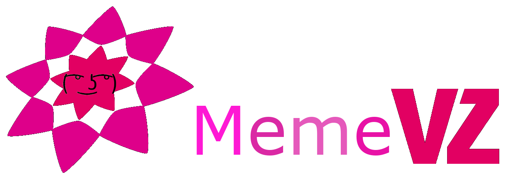

## Meme-VZ

[Image](MemeVZ3.png)

 Artifacts >  Requirements Artifact Set >  {More Requirements Artifacts} >  Software Requirements Specification >  SRS traditional

<Project Name>

Software Requirements Specification

For <Subsystem or Feature>

 

 

Version <1.0>

 

 

[Note: The following template is provided for use with the Rational Unified Process. Text enclosed in square brackets and displayed in blue italics (style=InfoBlue) is included to provide guidance to the author and should be deleted before publishing the document. A paragraph entered following this style will automatically be set to normal (style=Body Text).]

Revision History

Date

Version

Description

Author

<dd/mmm/yy>

<x.x>

<name>

 

 

 

 

 

 

 

 

 

 

 

 

 

Table of Contents

1.       Introduction         

1.1     Purpose     

1.2     Scope     

1.3     Definitions, Acronyms and Abbreviations     

1.4     References     

1.5     Overview     

2.       Overall Description    

3.       Specific Requirements

3.1     Functionality     

3.1.1         <Functional Requirement One>        

3.2     Usability     

3.2.1         <Usability Requirement One>           

3.3     Reliability     

3.3.1         <Reliability Requirement One>           

3.4     Performance     

3.4.1         <Performance Requirement One>           

3.5     Supportability     

3.5.1         <Supportability Requirement One>           

3.6     Design Constraints     

3.6.1         <Design Constraint One>           

3.7     Online User Documentation and Help System Requirements     

3.8     Purchased Components     

3.9     Interfaces     

3.9.1         User Interfaces           

3.9.2         Hardware Interfaces           

3.9.3         Software Interfaces           

3.9.4         Communications Interfaces           

3.10     Licensing Requirements     

3.11     Legal, Copyright and Other Notices     

3.12     Applicable Standards     

4.       Supporting Information    

Software Requirements Specification

1.                  Introduction
[The introduction of the Software Requirements Specification (SRS) should provide an overview of the entire SRS. It should include the purpose, scope, definitions, acronyms, abbreviations, references, and overview of the SRS.]

[Note: The Software Requirements Specification (SRS) captures the complete software requirements for the system, or a portion of the system.  Following is a typical SRS outline for a project using only traditional natural-language style requirements – with no use-case modeling.  It captures all requirements in a single document,  with  applicable sections inserted from the  Supplementary Specifications (which would no longer be needed).  For a template of an SRS using use-case modeling, which consists of a package containing Use-Cases of the use-case model and applicable Supplementary Specifications and other supporting information, see rup_SRS-uc.dot.]

[Many different arrangements of an SRS are possible.  Refer to [IEEE830-1998] for further elaboration of these explanations, as well as other options for SRS organization.]

1.1     Purpose
This SRS describes all specifications for "memeVZ". MemeVZ is a tribute to the popular SchülerVZ which was discontinued in 2013. It is a newer version for the younger generation to exchange ideas in a slightly different way. With MemeVZ we want to provide a new platform for viewing and sharing memes with people all over the world. Our goal is to reach the unreached with good qualtity content to laugh at. Everyone knows that a little laughter can cure anything.
“Find people that have the same kind of humor as you and you will never be alone” we say. To achieve all this we hold on to our Slogan: “Humor for humanity”.
In this document the usage of MemeVZ will be explained. Furthermore reliability, reaction speed and other important characteristics of this project will be specified. This includes design and architectural decisions regarding optimization of these criteria as well.

1.2     Scope
This software specification applies to the whole "MemeVZ" application. As already explained, MemeVZ is a tribute to the popular SchülerVZ which was discontinued in 2013. Share and display your favorite memes with a DH-wide community. Show what your humor is all about and make everyday life at dh a little bit funnier and amusing.

1.3     Definitions, Acronyms and Abbreviations
tbd

1.4     References
tbd

1.5     Overview
The following chapters are about our vision and perspective, the software requirements, the demands we have, licensing and the technical realization of this project.

2.                  Overall Description
[This section of the SRS should describe the general factors that affect the product and its requirements.  This section does not state specific requirements.  Instead, it provides a background for those requirements, which are defined in detail in Section 3, and makes them easier to understand. Include such items as:

•               product perspective

•               product functions

•             user characteristics

•               constraints

•               assumptions and dependencies

•               requirements subsets]

3.                  Specific Requirements
[This section of the SRS should contain all the software requirements to a level of detail sufficient to enable designers to design a system to satisfy those requirements, and testers to test that the system satisfies those requirements.   When using use-case modeling, these requirements are captured in the Use-Cases and the applicable supplementary specifications.  If use-case modeling is not used, the outline for supplementary specifications may be inserted directly into this section, as shown below.]

3.1     Functionality
[This section describes the functional requirements of the system for those requirements which are expressed in the natural language style. For many applications, this may constitute the bulk of the SRS Package and thought should be given to the organization of this section. This section is typically organized by feature, but alternative organization methods may also be appropriate, for example, organization by user or organization by subsystem.  Functional requirements may include feature sets, capabilities, and security.

Where application development tools, such as requirements tools, modeling tools, etc., are employed to capture the functionality, this section document will refer to the availability of that data, indicating the location and name of the tool that is used to capture the data.]

3.1.1     <Functional Requirement One>
[The requirement description.]

3.2               Usability
[This section should include all of those requirements that affect usability. For example,

•               specify the required training time for a normal users and a power user to become productive at particular operations

•               specify measurable task times for typical tasks or base the new system’s usability requirements on other systems that the users know and like

•               specify requirement to conform to common usability standards, such as IBM’s CUA standards Microsoft’s GUI standards]

3.2.1          <Usability Requirement One>
[The requirement description goes here.]

3.3     Reliability
[Requirements for reliability of the system should be specified here. Some suggestions follow:

•               Availability—specify the percentage of time available ( xx.xx%), hours of use, maintenance access, degraded mode operations, etc.

•               Mean Time Between Failures (MTBF) — this is usually specified in hours, but it could also be specified in terms of days, months or years.

•               Mean Time To Repair (MTTR)—how long is the system allowed to be out of operation after it has failed?

•               Accuracy—specify precision (resolution) and accuracy (by some known standard) that is required in the system’s output.

•               Maximum Bugs or Defect Rate—usually expressed in terms of bugs per thousand of lines of code (bugs/KLOC) or bugs per function-point( bugs/function-point).

•               Bugs or Defect Rate—categorized in terms of minor, significant, and critical bugs: the requirement(s) must define what is meant by a “critical” bug; for example, complete loss of data or a complete inability to use certain parts of the system’s functionality.]

3.3.1          <Reliability Requirement One>
[The requirement description.]

3.4     Performance
[The system’s performance characteristics should be outlined in this section. Include specific response times. Where applicable, reference related Use Cases by name.

•               response time for a transaction (average, maximum)

•               throughput, for example, transactions per second

•               capacity, for example, the number of customers or transactions the system can accommodate

•               degradation modes (what is the acceptable mode of operation when the system has been degraded in some manner)

•               resource utilization, such as memory, disk, communications, etc.

3.4.1          <Performance Requirement One>
[The requirement description goes here.]

3.5     Supportability
[This section indicates any requirements that will enhance the supportability or maintainability of the system being built, including coding standards, naming conventions, class libraries, maintenance access, maintenance utilities.]

3.5.1          <Supportability Requirement One>
[The requirement description goes here.]

3.6     Design Constraints
[This section should indicate any design constraints on the system being built. Design constraints represent design decisions that have been mandated and must be adhered to.  Examples include software languages, software process requirements, prescribed use of developmental tools, architectural and design constraints, purchased components, class libraries, etc.]

3.6.1          <Design Constraint One>
[The requirement description goes here.]

3.7     On-line User Documentation and Help System Requirements
[Describes the requirements, if any, for on-line user documentation, help systems, help about notices, etc.]

3.8     Purchased Components
[This section describes any purchased components to be used with the system, any applicable licensing or usage restrictions, and any associated compatibility and interoperability or interface standards.]

3.9     Interfaces
[This section defines the interfaces that must be supported by the application. It should contain adequate specificity, protocols, ports and logical addresses, etc. so that the software can be developed and verified against the interface requirements.]

3.9.1          User Interfaces
[Describe the user interfaces that are to be implemented by the software.]

3.9.2          Hardware Interfaces
[This section defines any hardware interfaces that are to be supported by the software, including logical structure, physical addresses, expected behavior, etc. ]

3.9.3          Software Interfaces
[This section describes software interfaces to other components of the software system. These may be purchased components, components reused from another application or components being developed for subsystems outside of the scope of this SRS but with which this software application must interact.]

3.9.4          Communications Interfaces
[Describe any communications interfaces to other systems or devices such as local area networks, remote serial devices, etc.]

3.10     Licensing Requirements
[Defines any licensing enforcement requirements or other usage restriction requirements that are to be exhibited by the software.]

3.11     Legal, Copyright, and Other Notices
[This section describes any necessary legal disclaimers, warranties, copyright notices, patent notice, wordmark, trademark, or logo compliance issues for the software.]

3.12     Applicable Standards
[This section describes by reference any applicable standard and the specific sections of any such standards which apply to the system being described. For example, this could include legal, quality and regulatory standards, industry standards for usability, interoperability, internationalization, operating system compliance, etc.]

4.                  Supporting Information
[The supporting information makes the SRS easier to use.  It includes:

•               Table of contents

•             Index

•               Appendices

These may include use-case storyboards or user-interface prototypes. When appendices are included, the SRS should explicitly state whether or not the appendices are to be considered part of the requirements.]
